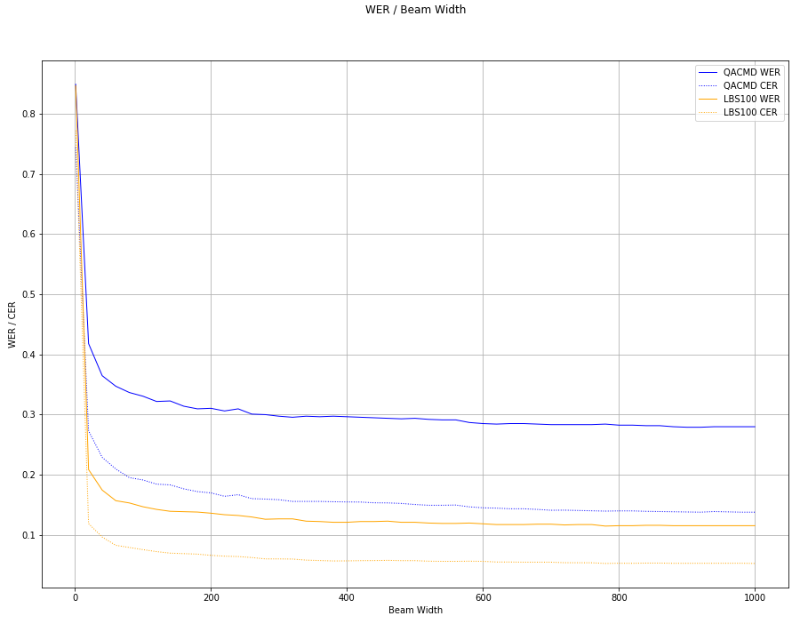
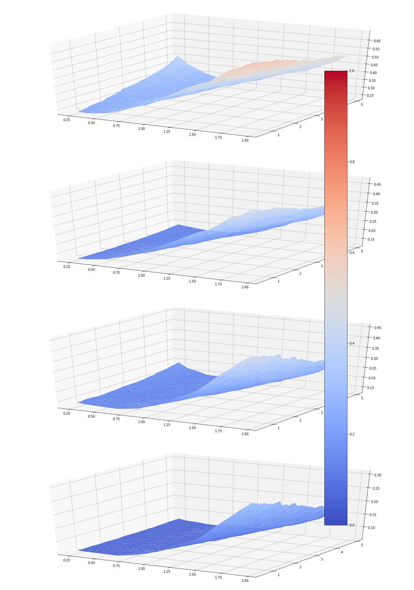

* Beam Width from 1 to 1000 with 0.5.1 model, on a small subset of LBS test clean and a comparable small private corpus

Alpha from 0.25 to 2, Beta from 0.55 to 5, with 0.5.1 model

From top to down, it's

* WER on a small private corpus
* CER on a small private corpus
* WER on a small subset of LBS test clean
* CER on a small subset of LBS test clean

